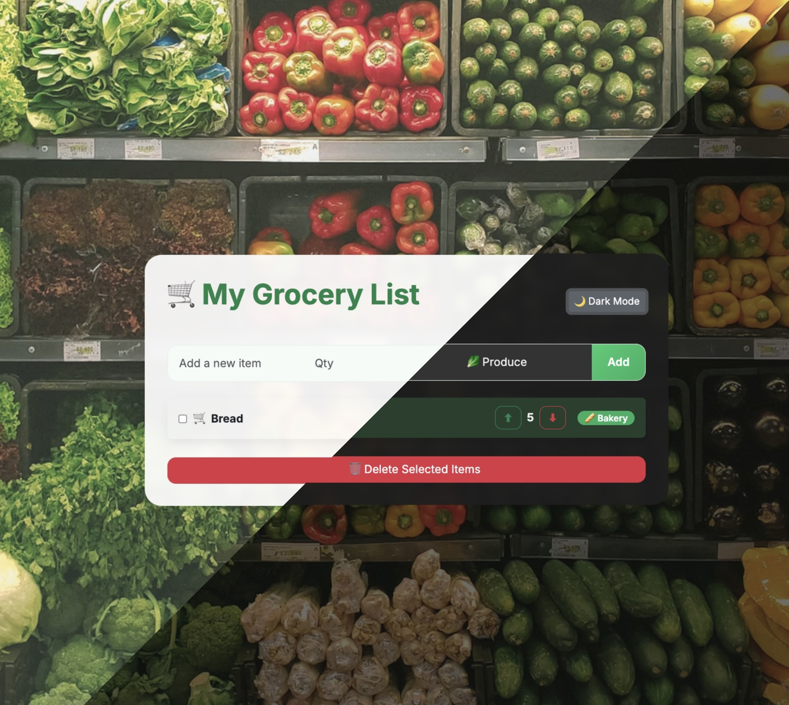
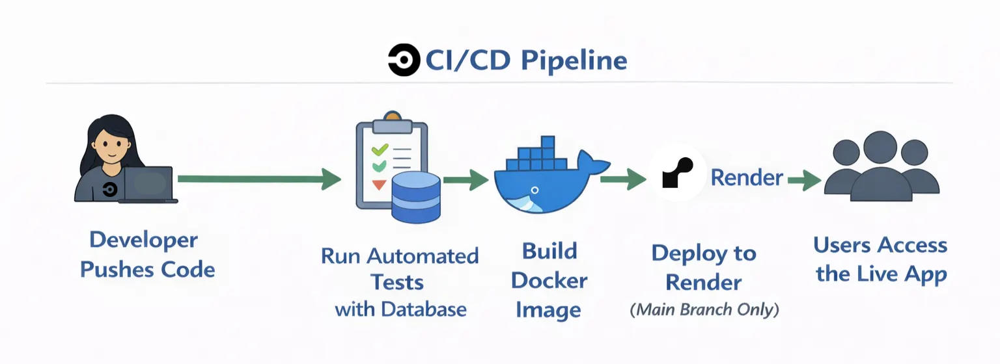

# CircleCI GroceryApp

GroceryApp is a web-based Flask application that can be built, tested, and delivered using an automated CI/CD pipeline. It allows users to manage their grocery items by category and quantity through a clean, simple interface.

Code changes are continuously checked through automated testing in **CircleCI**. Tests run in an isolated environment with a PostgreSQL database provided as a sidecar container, which helps catch issues early and mirrors the conditions of a production environment.

After tests pass, the pipeline builds Docker images for multiple architectures (amd64 and arm64) and pushes them to a container registry, making deployments consistent and portable across different environments. For approved changes merged into the **main branch**, the pipeline automatically deploys the latest version of the application to **Render (PaaS)**. 

🔗 Live Application: https://groceryapp-latest.onrender.com

---

## ✨ Key Features

- **Add, Update, and Organize Grocery Items:** Quickly add groceries to your list and assign them to categories like Produce, Dairy, Meat, Bakery, Pantry, Snacks, or Drinks.
- **Category Badges & Visual Cues:** Each item is labeled with its category and an emoji, making it easy to scan and visually identify items.
- **Track Item Quantities:** Easily keep track of how many of each item you need, and increment or decrement quantities with a single click.
- **Bulk Deletion:** Remove multiple items at once to keep your list clean and up to date.
- **Dark Mode Support:** Toggle between light and dark themes for comfortable viewing in any lighting. 
- **Responsive & Mobile-Friendly:** Works well on any device, so you can manage your grocery list on the go.

## 🏗 Architecture Overview

The application is built using:
- **Flask** for the web application backend
- **PostgreSQL** for the database
- **Docker** for consistent packaging and deployment
- **CircleCI** for automated testing, building, and deployment
- **Render** as the production hosting platform (PaaS)

## 🔄 CI/CD Pipeline Overview

The CircleCI pipeline automates the following steps:

1. Run automated tests using a PostgreSQL sidecar container.
2. Build a multi-architecture Docker image (amd64 and arm64).
3. Push the image to a container registry.
4. Deploy the application to Render on approved merges to the main branch.

The diagram above shows how the code moves from development through testing, building, and deployment using CircleCI.

## 🔐 Security & Secrets Management

- Sensitive values (database credentials, Docker credentials, deploy hooks) are stored securely in CircleCI.
- Secrets are only accessible to approved builds.

## 🚀 Future Improvements

- Introduce a pre-production area to preview updates.
- Add token-based authentication for cloud deployments.
- Introduce automated security scans for dependencies, code, and container images.
- Improve test coverage and performance testing.

---

# GroceryApp

---
